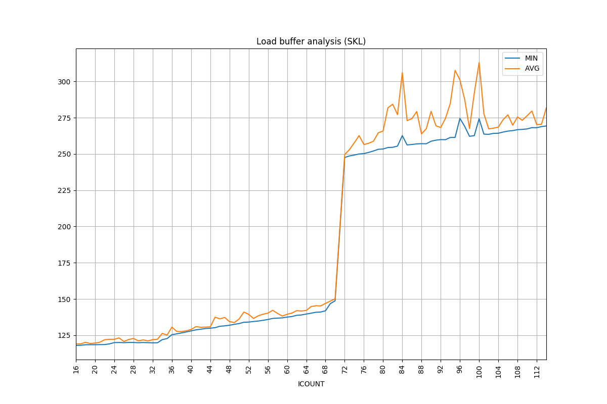

[](https://travis-ci.org/travisdowns/robsize)

This is an updated copy of the [ROB](https://en.wikipedia.org/wiki/Re-order_buffer) size testing tool described by [Henry Wong on his blog](http://blog.stuffedcow.net/2013/05/measuring-rob-capacity) and reproduced here with permission. It can be used to measure the size of not only the ROB, but various other microarchitectural buffer sizes, such as the load and store buffers, the GP, vector and mask phystical register file sizes, and so on. It includes several additional tests beyond those used in the original blog post.

Build it with `make` and run it like `./robsize ID` where `ID` is a test ID from 0 to 33 (run `./robsize --list` to show the available tests).

There are a few options that you can see with `./robsize --help`:

```
Usage: robsize [TEST_ID] [OPTIONS]

	--csv      	  Output in csv format suitable for plotting
	--slow     	  Run more iterations making the test slower but potentiallly more accurate
	--fast     	  Run fewer iterations making the test faster but potentiallly less accurate
	--superfast	  Run at ludicrous speed which is even less accurate than --fast
	--write-asm	  Print the raw generated instructions to a file and quit
	--list     	  List the available tests and their IDs
	--start=START Use START to specify the initial value of filler instruction count (Default = 16)
	--stop=STOP   Use STOP to specify the maximum value of filler instruction count (Default = 256)
```

## Supported Platforms

### Operating Systems

This should run fine on any modern Linux, including [Windows Subsystem for Linux](https://docs.microsoft.com/en-us/windows/wsl/about).

### Hardware

Some tests require AVX, AVX2 or AVX-512, which should mostly be obvious from the description in `robsize --list`. There is no checking whether the current hardware supports the needed ISA, running those specific tests on hardware that doesn't support it will simply crash with an Illegal Instruction fault (pull requests welcome).

## Interesting Tests

There are currently 27 different tests, so here I'll quickly note which are the most interesting for determining the main parameters of your system.

A common theme is that many of the tests will probably detect the _same_ architectural feature (e.g., the ROB size), but do it in a slightly different way (e.g, with different type of nops, or different ALU operations, etc). One would expect them to give the same result, but if they give different results then they may reveal something interesting about the system. So the tests below aren't the _only_ ones that detect the particular feature!

All of the tests use the same basic structure: memory accesses that miss in the cache, separated by different types of operations (instructions). Only the operations vary, so when we say that a test "uses single byte NOPs" (for example), it is to be understood that the test consists as always of memory accesses separated by various amounts of single byte NOPs.

### Tests 1 and 4

These tests use single byte or double byte NOPs to detect the ROB size. They should both give the same answer, since only difference is that single byte NOPs tend to disable the use of micro-op cache since they are too dense, while double-byte NOPs use the cache. I wouldn't expect that to affect the apparent ROB size, but it's nice to be able to check!

### Test 0

This uses a series of general-purpose register additions, each one of which should consume a physical register, to test the size of the speculative register file.

### Test 11 and 19

These use SIMD xor operations (with different registers so it is not a zeroing idiom) to test the size of the SIMD register file. Test 11 uses SSE and xmm registers, while test 19 uses AVX2 and ymm registers. On the machines I am aware of, they give the same results but maybe one day it will be different!

### Test 32 and 33

These determine the load buffer (test 32) and store buffer (test 33) sizes respectively, by using loads and stores as the filler instructions.

### Tests 39, 40 and 41

These show that while there is no sharing between mask (kreg) registers and SSE/AVX registers (test 39) or general purpose registers (test 40), there _does_ seem to be sharing between mask registers and x87/MMX registers (test 41) -- they appear to draw from a common pool of ~150 physical registers. Details [here](https://travisdowns.github.io/blog/2020/05/26/kreg2.html#skx-41).

## Plotting

You can plot the data for easy analysis using the included [scripts/plot-csv.py](scripts/plot-csv.py).

For example, the following command (after almost 7 minutes, use `--fast` if you don't want to wait that long):

```
 ./robsize 32 --csv | head -n100 | scripts/plot-csv.py --xrotate=90 --tick-interval=4 --cols 1 2 --title="Load buffer analysis (SKL)"
 ```

 Generates this chart:

 

## Related Work

 - [Microarchitecturometer](https://github.com/Veedrac/microarchitecturometer) is an implementation of this idea, but which generates the test variants at compile-time using a Python script. It supports Arm in addition to x86.
 - [rob.rs](https://github.com/eigenform/lamina/blob/main/bin/rob.rs) is a (much more readable) implementation of this idea, also using JIT and which uses actual mnemonics rather than line hex machine code.  
    
   
## References

H. Wong, _Measuring Reorder Buffer Capacity_, May, 2013. [Online]. Available: http://blog.stuffedcow.net/2013/05/measuring-rob-capacity/

[A Note on Mask Registers](https://travisdowns.github.io/blog/2019/12/05/kreg-facts.html) describes using this tool to measure the mask (kreg) PRF size

[AVX-512 Mask Registers, Again](https://travisdowns.github.io/blog/2020/05/26/kreg2.html) describes using this tool to verify a theory that the mask registers are shared with the x87/MMX registers
